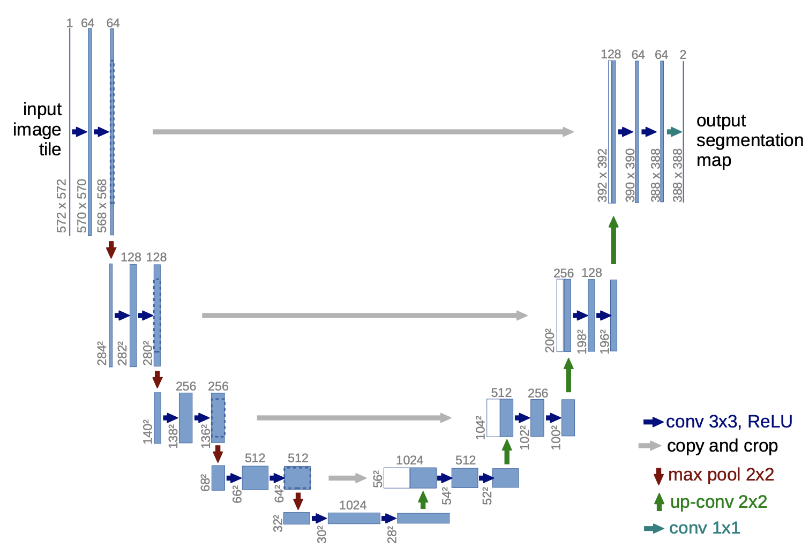
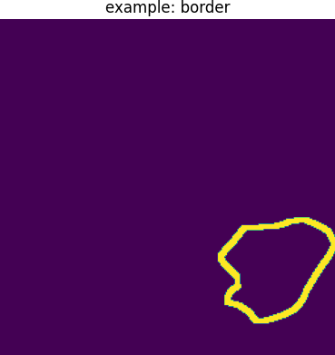
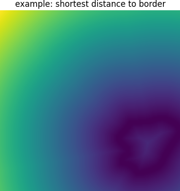
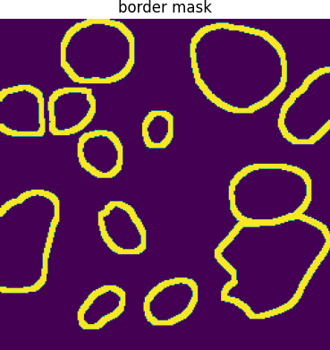
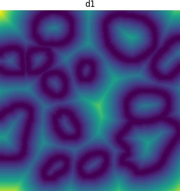
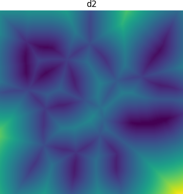
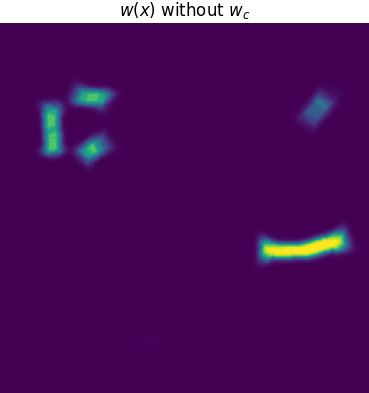
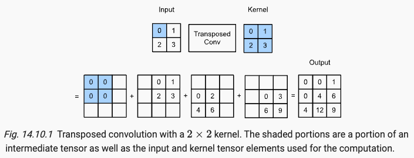
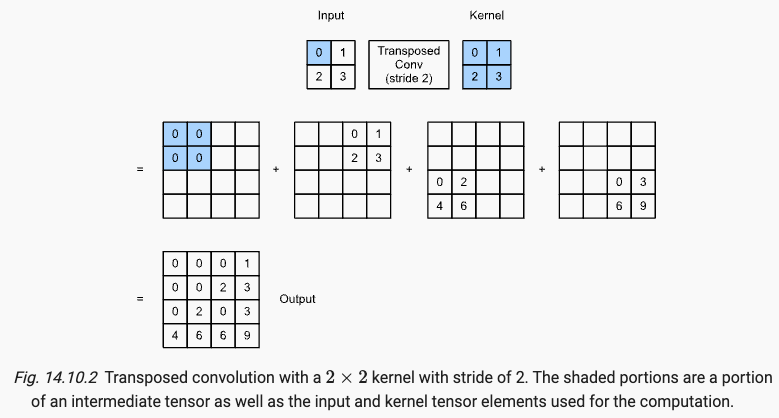

# Project Name
U-Net implementation

# Summary
Implementation of U-Net based on the paper along with a close-look into the model architeture and training scheme. 

# How to run 
Run  
```console
python main.py
```
to see the model summary using torchinfo.


# Model Structure
<p align="center">

</p>

# Key points
1. The key challenge in segmentation tasks is to balance between recognizing beyond local patterns in data (context) and being able to identify the boundary structures (localization). 
2. The downsampling path captures context as we go deeper since the receptive field gets larger and larger. However, we loose spacial information as the image dimension gets shrunken with pooling. 
3. The upsampling performs the localization as the spatial dimensions are increased while the context from the downsampling is injected at different stages of the upsampling. This allows us to achieve localization while utilizing context. 
4. To segment touching objects properly, which can be challenging, the use of a weighted loss, where the pixels in between these touching objects are given more weight and wrong segmentations here are heavily penalized. 

# Network architecture breakdown
*Downsampling path*: consists of the repeated application of two 3x3 convolutions (unpadded convolutions), each followed by a rectified linear unit (ReLU) and a 2x2 max pooling operation with stride 2. At each step we double the number of feature channels.

*Upsampling*: every step consists of an upsampling of the feature map followed by a 2x2 convolution that halves the number of feature channels, a concatenation with the correspondingly cropped feature map from the contracting path, and two 3x3 convolutions, each followed by a ReLU. The cropping is necessary due to the loss of border pixels in every convolution.

*Final layer*: a 1x1 convolution is used to map each 64-component feature vector to the desired number of classes.

Input specifications if tiling to segment a large image: To allow a seamless tiling of the output segmentation map, it is important to select the input tile size such that all 2x2 max-pooling operations are applied to a layer with an even x- and y-size.

# Training
### 1. Gradient Descent with Momentum

Note that this "momentum" is different from the momentum in rotational mechanics. In regular gradient descent, the update looks like:

$$w_{t+1} = w_t - \alpha_t \nabla L(w_t)$$

Some drawbacks of this update rule are:
(i) If we arrive at a point where $\nabla L(w_t) = 0$ that is not even a local minimum, such as a saddle point, the update stops, which is undesirable. <br>
(ii) The path followed by gradient descent is jittery. This can be due to parameters (e.g. learning rate) that are not the optimal or since we are optimizing based on gradients obtained from a batch of samples, which might not accurately represent the full training dataset. 

When we add momentum to the expression above, we define a velocity term that is dependent on past velocities

$$v_{t+1} = \beta_t v_t + \alpha_t \nabla L(w_t)$$
$$w_{t+1} = w_t - v_{t+1}.$$

With this addition, even if $\nabla L(w_t) = 0$ the weights will still get updated due to the influence of past gradients, preventing the optimization from stalling.

### 2. Loss function
Note that given $K$ classes, each pixel will be classified to one of them. The final $K$ channels in the network will represent the $K$ classes. For each pixel location $x$, the probability of the pixel belonging to class $k$ is defined using the softmax function as 

$$p_k(x) = \frac{\text{exp}(a_k(x))}{\Sigma_{i = 1}^K \text{exp}(a_i(x))}$$

where $a_k$ is the feature map of the $k$'th channel. Let $l(x)$ be the true lable of the pixel at position $x$ and the cross entropy loss is computed as 

$$L = - \sum_{x} w(x) \log (p_{l(x)}(x)).$$

$w(x)$ are weights that will be explained below.

### 3. Weight map 
We want the network to be attentive to the small separation borders between touching cells. Thus, we furter penalize mistakes on such cells. Below is an example of found border pixels (yellow) from the PanNuke dataset. The border was found using morphological transformations (see code below for details).  `cells_mask` is a mask of all of the cells in the image. 

In the original U-Net paper, the weight $w(x)$ is then calculated as

$$w(x) = w_c(x) + w_0 \cdot \exp \left (-\frac{(d_1(x) + d_2(x))^2}{2\sigma^2} \right )$$

where $w_c: {1, 2, ..., K} \to R$ is the weight map to balance the class frequencies among pixels (for example, most of the pixels might be the background instead of the objects of interest),  $d_1$ is the distance to the border of the nearest cell and $d_2$ is the distance to the border of the second nearest cell. Below is how $d_1$ and $d_2$ can be computed. The trick is to use `scipy.ndimage.distance_transform_edt`. 

```
# get individual mask of cells
num_components, cell_masks = cv2.connectedComponents(cells_mask)
# record each pixel's distance to the border of a cell
dist_maps = np.zeros((num_components - 1, cell_masks.shape[0], cell_masks.shape[1]))
# record all borders
border_sum = np.zeros((cells_mask.shape))
for i in range(1, num_components):
    # get mask for cell
    mask = ((cell_masks == i) * 1).astype(np.uint8)

    # obtain border
    kernel = np.ones((3,3), np.uint8)
    dilated = cv2.dilate(mask, kernel, iterations=3)
    eroded = cv2.erode(mask, kernel, iterations=1)
    border = dilated - eroded

    border_sum += border

    print("border")
    plt.imshow(border)
    plt.show()

    # obtain distance from each pixel location to the closest cell border
    dist_transform = distance_transform_edt(border == 0)
    dist_maps[i-1] = dist_transform

    print("shortest distance to border")
    plt.imshow(dist_transform)
    plt.show()

border_mask = (border_sum != 0) * 1
print("border mask")
plt.imshow(border_mask)
plt.show()

partitioned = -np.partition(-dist_maps, -2, axis=0)

# Now, the top 2 values are the last two entries along the c dimension.
top_2_values = partitioned[-2:, :, :]
# sort in ascending order
top_2_values_sorted = np.sort(top_2_values, axis=0)

print("d1")
plt.imshow(top_2_values_sorted[0])
plt.show()

print("d2")
plt.imshow(top_2_values_sorted[1])
plt.show()
    
```

<div style="display: flex;">


</div>

<div style="display: flex;">



</div>

If we let $w_c = 0$, $w_0 = 10$, and $\sigma=5$ then $w(x)$ for this example is

<div style="display: flex;">

</div>


## Transposed Convolution (aka fractionally-strided convolution)
As opposed to convolution and pooling which reduces (downsamples) the input dimensions, transposed convolution is supposed to upsample the input. 

<p align="center">

</p>

Following the example in the figure from d2l.ai, given a 2x2 input and a 2x2 kernel and if the **stride is 1**, the output will be (2 + 2 - 1) x(2 + 2 - 1) and in general $(h + k_h - 1 ) \times (w+ k_w - 1 )$. We multiply each element in the input tensor with the kernel and place the result in the $3 \times 3$ tensor. We add up the results from each input element to obatin the final result. 

The padding is described as follows in the PyTorch documentation: The padding argument effectively adds dilation * (kernel_size - 1) - padding amount of zero padding to both sizes of the input. This is set so that when a Conv2d and a ConvTranspose2d are initialized with same parameters, they are inverses of each other in regard to the input and output shapes. 


The stride is in terms of the output tensor. Below is an example when stride is 2. 

<p align="center">

</p>

## Localization
Object localization is the process of identifying the location of an object in an image or video.

# References
https://d2l.ai/chapter_computer-vision/transposed-conv.html <br>
https://pytorch.org/docs/stable/generated/torch.nn.ConvTranspose2d.html#:~:text=the%20width%20dimension-,NOTE,-The%20padding%20argument

